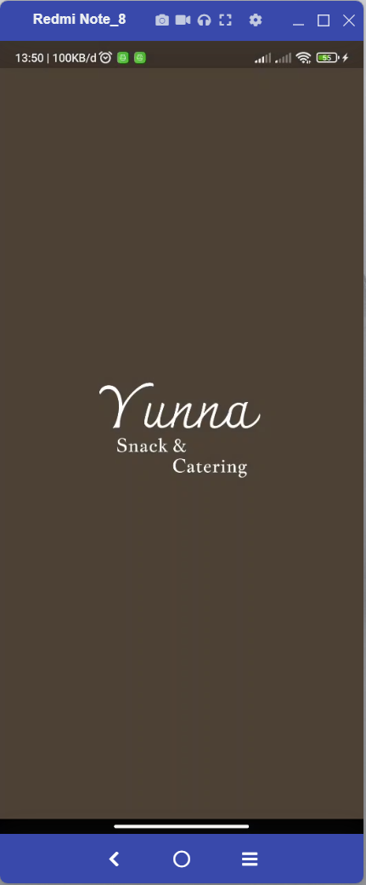
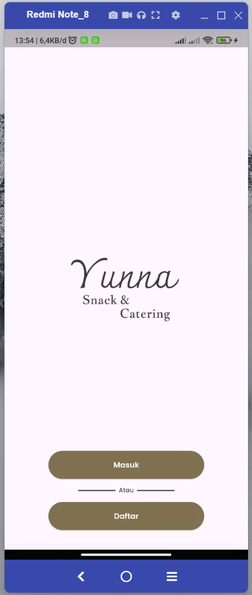
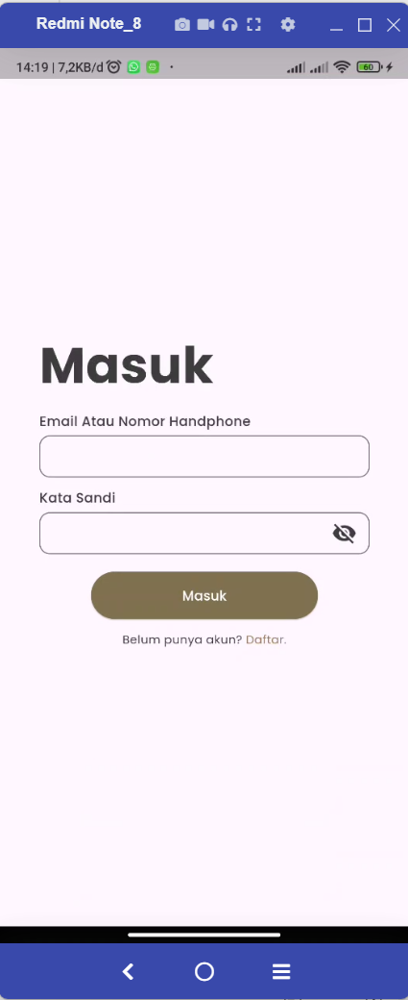
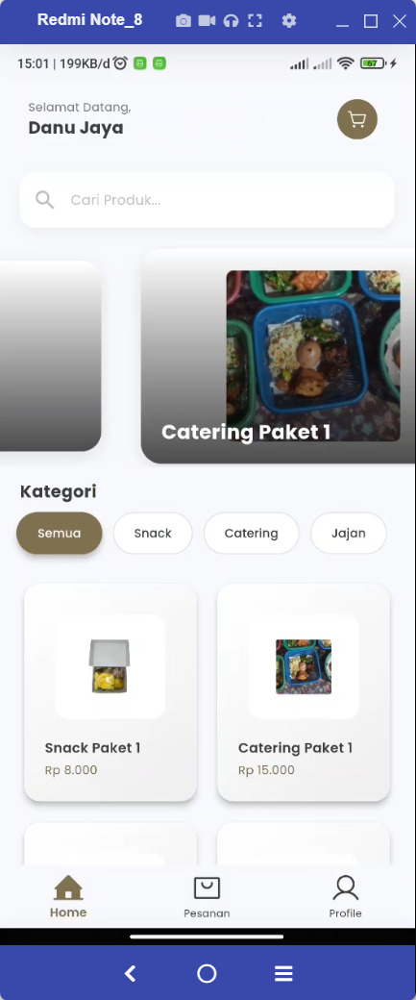
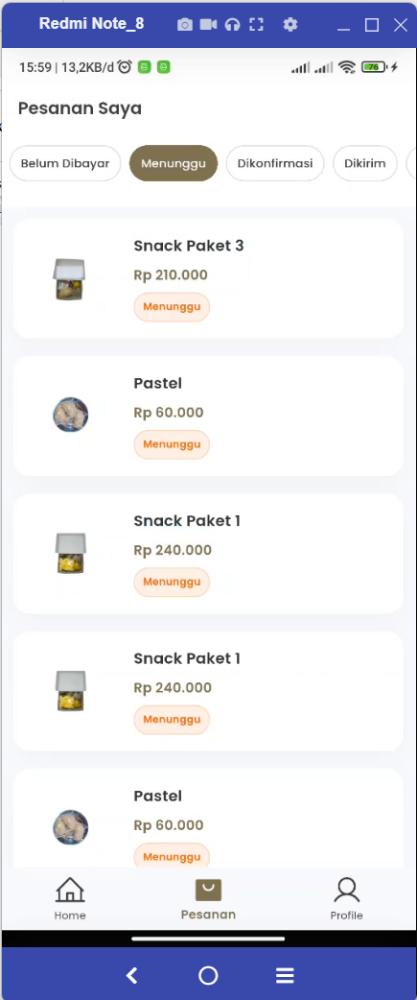
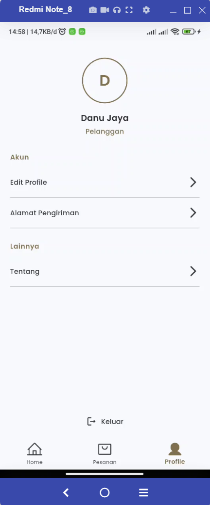

# Pemesanan Snack & Catering

Ini adalah proyek **full-stack** yang menggabungkan **Flutter** untuk aplikasi mobile dan **Laravel** sebagai backend API. Aplikasi ini dirancang untuk mengelola pemesanan snack dan catering.

## Struktur Proyek

Proyek ini terdiri dari dua bagian utama:

1. **Flutter App**: Aplikasi mobile yang dibangun dengan Flutter. Aplikasi ini memungkinkan pengguna untuk berinteraksi dengan backend melalui API.
   - Lokasi: `ordermobile/`
   
2. **Laravel Backend**: Backend API yang dibangun dengan Laravel untuk mengelola data, transaksi, dan autentikasi.
   - Lokasi: `backend/`

## Fitur Utama

- **Autentikasi Pengguna**: Login dan registrasi pengguna menggunakan email dan password.
- **3 Role**: Terdapat 3 Role Utama yaitu User, Admin, dan SuperAdmin
- **Manajemen Produk**: Pengguna dapat melihat produk, sedangkan admin dapat mengelola produk.
- **Pembayaran**: Integrasi dengan sistem pembayaran Midtrans.
- **Manajemen Pesanan**: Admin dapat mengelola status pesanan, sementara pengguna dapat membuat dan melihat status pesanan.

## Persyaratan

### Laravel Backend
- PHP >= 8.1
- Composer
- MySQL atau database lain sesuai kebutuhan

### Flutter App
- Flutter SDK >=3.3.4 <4.0.0
- Android Studio atau Visual Studio Code dengan plugin Flutter dan Dart

## Hasil Aplikasi Mobile Pemesanan Snack & Catering

### Splash Screen

### Landing Page

### Login

### Home

### Pesanan

### Profil

